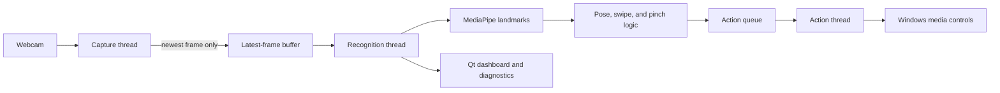

# GestureOS

GestureOS is a Windows desktop application for touch-free media control. It uses
a webcam to recognize hand poses, swipes, and pinch motion, then maps them to
playback and volume actions. A double clap can enable or pause recognition.


## Highlights

- Real-time, single-hand tracking with MediaPipe and OpenCV.
- Configurable JSON gesture bindings and per-gesture enable controls.
- Open-palm, fist, thumb, pointing, peace, swipe, and pinch recognition.
- Non-blocking capture, recognition, and action worker threads.
- Capacity-one latest-frame buffering to prevent latency buildup.
- Live confidence, performance diagnostics, activity history, and status indicators.
- Persisted dark and light themes.
- System-tray operation, double-clap activation, and optional Windows startup.
- PyInstaller portable build and NSIS installer.
- 80% branch-coverage quality gate with unit, integration, UI, and benchmark tests.

## Quick start

GestureOS targets Python 3.11 on Windows 10 or 11.

```powershell
py -3.11 -m venv .venv
.venv\Scripts\Activate.ps1
pip install -r gestureos\requirements.txt
python -m gestureos.main
```

Allow desktop applications to access the camera and microphone when Windows asks.

## Default controls

| Gesture | Default action |
|---|---|
| Open Palm | Play / Pause |
| Thumbs Up | Volume Up |
| Thumbs Down | Volume Down |
| Peace Sign | Next Track |
| Pointing | Previous Track |
| Swipe Left | Previous Track |
| Swipe Right | Next Track |
| Pinch and move vertically | Adjust volume |
| Double clap | Enable or pause recognition |

Fist recognition is available but disabled by default. Every static and swipe
gesture can be enabled, disabled, or rebound from **Settings**.

## How it works



The buffer discards stale frames when recognition cannot keep up. Media-key calls
run on a separate action worker, keeping inference and the UI responsive.

## Documentation

- [User Guide](docs/USER_GUIDE.md)
- [Developer Guide](docs/DEVELOPER_GUIDE.md)
- [Architecture](docs/ARCHITECTURE.md)
- [Benchmark Report](docs/BENCHMARK_REPORT.md)
- [Troubleshooting](docs/TROUBLESHOOTING.md)
- [Release Guide](RELEASE.md)
- [Product Review](PRODUCT_REVIEW.md)

## Testing

```powershell
.\run_tests.cmd -q
```

The command enforces at least 80% branch coverage and writes JUnit, XML coverage,
and HTML coverage reports to `test-results/`.

## Building a release

Install NSIS, then run:

```powershell
winget install --id NSIS.NSIS -e
.\build_release.cmd
```

Outputs are written to `dist/`: a portable executable, an NSIS installer, and
SHA-256 checksums.

## Privacy

Camera frames and microphone samples are processed locally. GestureOS does not
contain networking, telemetry, account, or cloud-upload functionality. The camera
is opened only while recognition is enabled; the microphone listens locally for
the double-clap activation pattern while the application is running.

## Contributing and security

Contributions are welcome; see [CONTRIBUTING.md](CONTRIBUTING.md). Please report
security concerns privately using the process in [SECURITY.md](SECURITY.md).

GestureOS is available under the [MIT License](LICENSE).
