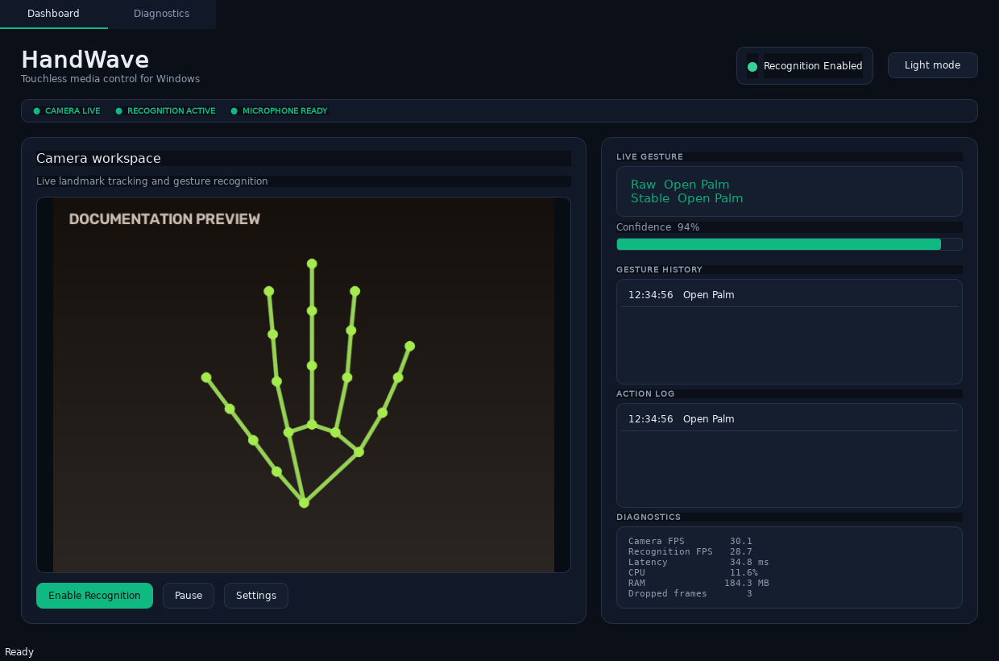
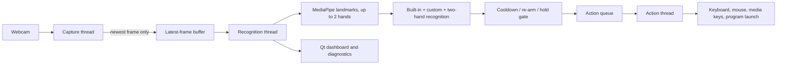

# HandWave

A local Windows touchless open source tool that turns hand gestures and other
motion controls into configurable actions.



## What it does

HandWave watches your webcam for hand poses, swipes, pinches, and two-hand
gestures, and maps each one to a configurable action (a media key, a
keyboard shortcut, a mouse click, typed text, or a local program launch). A
double clap can enable or pause recognition without touching the keyboard.

> Note: Everything runs on your machine, nothing is uploaded anywhere.

## Features

- Real-time, up-to-two-hand tracking with MediaPipe and OpenCV.
- An extensible action abstraction: media keys, single keys, keyboard
  combinations, mouse clicks/scroll, typed text, or a validated local
  program launch with per-action confirmation/hold and cooldown.
- Two-hand gestures (both palms open, both fists, hands moving apart/together),
  arbitrated against pinch, swipe, and static poses in a documented priority order.
- Application profiles that override gesture bindings/sensitivity/cooldown
  per app (e.g. different bindings for a media player vs. a browser), with
  automatic switching based on the focused window.
- Static custom gestures: record a pose a few times, and HandWave builds a
  recognition profile for it that coexists with the built-in gestures.
- A bounded action-audit log showing every recognized gesture, the action
  taken, and — when nothing happened — exactly why (cooldown, re-arm, hold
  duration, disabled, or an execution error).
- Non-blocking capture, recognition, and action worker threads; a
  capacity-one latest-frame buffer prevents latency buildup under load.
- Live confidence, performance diagnostics, activity history, and status indicators.
- System-tray operation, double-clap activation (with ambient-noise
  calibration), and optional Windows startup.
- A landmark record/replay tool for deterministic, camera-free testing.
- PyInstaller portable build and NSIS installer.
- An 80%-coverage test gate across unit, integration, UI, and benchmark tests.

## Example gestures

| Gesture | Default action |
|---|---|
| Open Palm | Play / Pause |
| Thumbs Up | Volume Up |
| Thumbs Down | Volume Down |
| Peace Sign | Next Track |
| Pointing | Previous Track |
| Swipe Left / Right | Previous / Next Track |
| Pinch and move vertically | Adjust volume |
| Both palms open, moving apart/together | Two-hand gesture (configurable) |
| Double clap | Enable or pause recognition |

Every gesture's action can be changed to a key, hotkey, mouse action, typed
text, or program launch from Settings → Gestures & Actions

## How it works



Capture, recognition, and action execution each run on their own thread, so a
slow OS call or a busy inference frame can never freeze the UI. See
[docs/architecture.md](docs/architecture.md) for the full component diagram.

## Performance / latency architecture

The recognition thread only processes the latest camera frame. A
capacity-one buffer discards stale frames instead of queuing them, so
recognition latency stays bounded even under overload. Action execution
(keyboard/mouse/media-key/program calls) never runs on the recognition
thread either, it's handed off to a separate action-queue worker.

## Benchmark results

(See [docs/benchmarking.md](docs/benchmarking.md) for methodology and caveats):

| Metric | FIFO | Latest frame |
|---|---:|---:|
| P95 latency | 934 ms | 14 ms |
| Frames dropped (of 120) | 0 | 91 (intentional) |

| Metric | Synchronous actions | Queued actions |
|---|---:|---:|
| Recognition blocked | 216 ms | 0.18 ms |

Dropped frames under the latest-frame strategy are a deliberate response to
overload, not data loss.

## Privacy

- Camera frames and microphone samples are processed locally; neither is
  ever uploaded or recorded to disk by default.
- No networking, telemetry, accounts, or cloud dependencies.
- Custom-gesture recording stores normalized landmark coordinates, never
  video (see [docs/gesture-recognition.md](docs/gesture-recognition.md)).
- Program-launch actions are validated and always require a confirmation
  hold before they can fire (see [docs/actions.md](docs/actions.md)).

## Requirements

- Windows 10 or 11
- Python 3.11
- A webcam
- A microphone (for optional double-clap activation/deactivation)

## Quick Start

```powershell
.\setup.cmd
.\run.cmd
```

`setup.cmd` verifies Python 3.11, creates `.venv` if needed, and installs
`handwave\requirements.txt`. `run.cmd` starts HandWave from that environment.
>Allow desktop applications to access the camera and microphone when Windows asks.

## Development

See [docs/development.md](docs/development.md) for the repository layout,
engineering model, and how to extend settings, gestures, or actions.

## Testing

```powershell
.\run_tests.cmd -q
```

Enforces at least 80% branch coverage and writes JUnit, XML coverage, and
HTML coverage reports to `test-results/`.

## Build

```powershell
winget install --id NSIS.NSIS -e
.\build_release.cmd
```

Outputs are written to `dist/`: a portable executable, an NSIS installer, and
SHA-256 checksums.

## Known limitations

- Custom gestures currently support static single-hand poses only; motion
  and two-hand custom gestures are not yet implemented
- Two-hand tracking can occasionally swap which hand is "primary" for a
  single frame when hands cross rapidly; this is a display flicker, not a crash.

## Documentation

- [User Guide](docs/USER_GUIDE.md)
- [Architecture](docs/architecture.md)
- [Gesture Recognition](docs/gesture-recognition.md)
- [Actions](docs/actions.md)
- [Application Profiles](docs/profiles.md)
- [Benchmarking](docs/benchmarking.md)
- [Development](docs/development.md)
- [Troubleshooting](docs/troubleshooting.md)
- [Release Guide](RELEASE.md)
- [Product Review](PRODUCT_REVIEW.md)

## Contributing and security

Contributions are welcome; see [CONTRIBUTING.md](CONTRIBUTING.md). Please report
security concerns privately using the process in [SECURITY.md](SECURITY.md).

HandWave is available under the [MIT License](LICENSE).