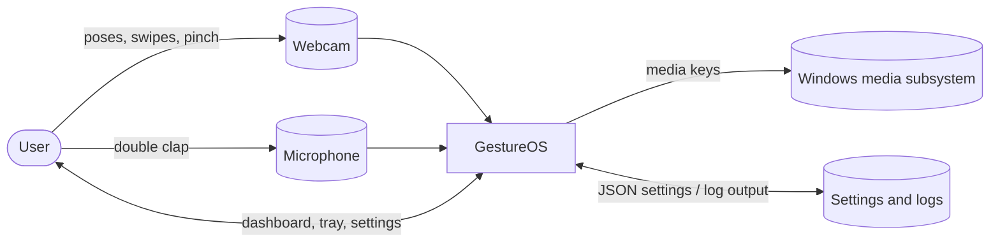
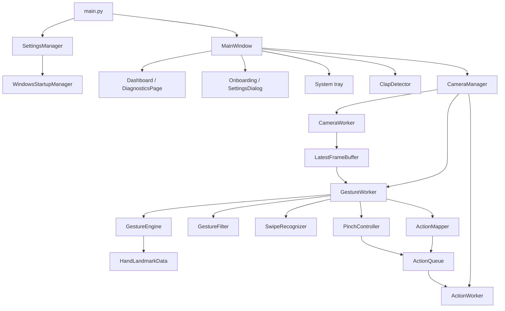
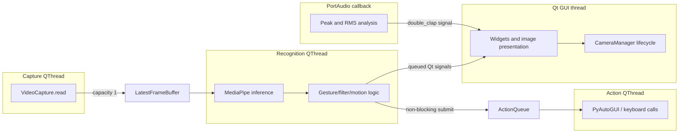
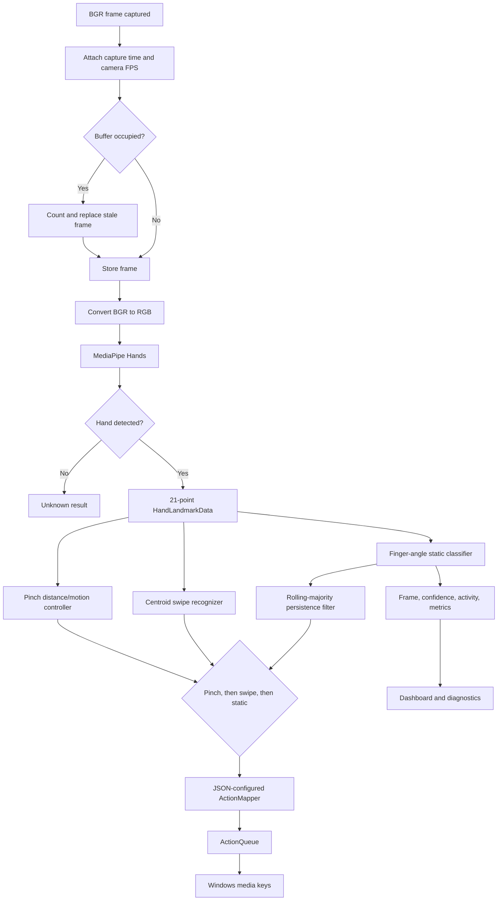
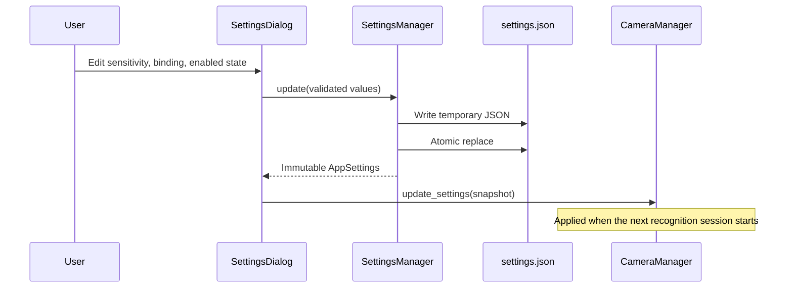

# GestureOS Architecture

## Design goals

GestureOS prioritizes fresh input over processing every frame, keeps blocking work
away from the UI, confines mutable recognition state to one worker, and isolates
OS side effects behind an action queue. The application is Windows-specific at its
camera backend, media-key, startup, packaging, and diagnostics boundaries.

## System context

No network service or database is involved.

## Component architecture

## Threading model

`threading.Event` requests capture and recognition shutdown. `LatestFrameBuffer`
uses a `Condition`; `ActionQueue` uses `queue.Queue`. Qt signals deliver results to
the main thread. Shutdown never waits synchronously in the GUI.

## Frame and gesture pipeline

## Action semantics

Static gestures must transition away before firing again. `ActionMapper` applies a
global cooldown. Swipes have independent motion and cooldown checks. Pinch volume
uses smoothed vertical movement and short step cooldowns. Every OS call is accepted
into a FIFO queue and executed on the action worker. Action errors are logged and
do not terminate recognition.

## Configuration and persistence

Installed builds store settings under `%APPDATA%\GestureOS\config`. Source runs use
the repository configuration file. First-run onboarding state uses `QSettings`.

## Diagnostics

Capture timestamps travel with frames. The recognition worker calculates throughput
and capture-to-recognition latency, while `DiagnosticsMonitor` samples process CPU
and Windows working-set memory. `CameraManager` adds the number of live pipeline
threads before forwarding the immutable `PipelineMetrics` snapshot to the UI.

## Failure and shutdown behavior

- Camera and recognition exceptions emit one user-visible pipeline error.
- Worker `finally` blocks release camera and MediaPipe resources.
- Stopping closes the latest-frame buffer, allowing recognition to wake immediately.
- Recognition completion closes the action queue after all accepted commands.
- Each worker requests its event loop to quit; manager cleanup occurs after all
  three thread-finished signals.
- Application exit waits asynchronously for that terminal signal.

## Packaging architecture

PyInstaller creates a windowed single executable containing Python, Qt, MediaPipe,
OpenCV, assets, and native dependencies. NSIS installs it per-user, creates desktop
and Start Menu shortcuts, registers an uninstaller under HKCU, and supports `/S`.
