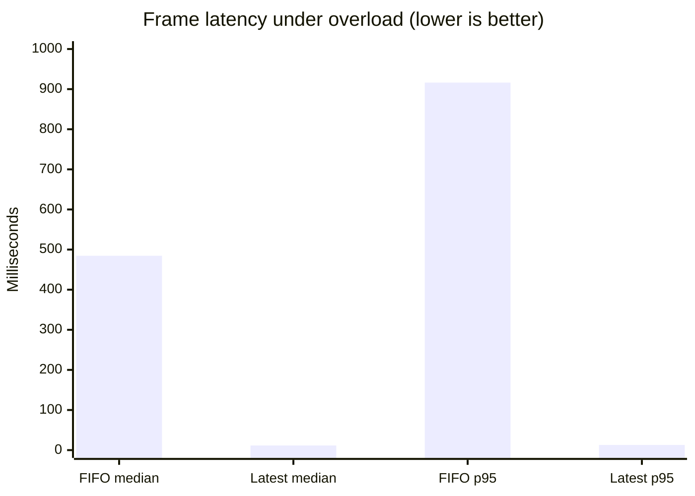

# GestureOS Benchmark Report

## Executive summary

The production latest-frame pipeline reduced p95 frame latency from **916.4 ms to
12.8 ms** under the synthetic overload workload, a **71.6× improvement**. The
action queue reduced recognition-thread blocking for 40 simulated OS actions from
**220.9 ms to 0.21 ms**, while executing all 40 actions.

These benchmarks validate architecture-level latency properties. They are not a
substitute for camera and MediaPipe profiling on target hardware.

## Environment

| Field | Value |
|---|---|
| Date | 2026-09-06 |
| Operating system | Windows 10-compatible environment |
| Python | 3.11.9 |
| PyInstaller environment | Project `.venv` |
| Benchmark module | `benchmarks.benchmark_frame_latency` |

## Methodology

### Frame-buffer comparison

Both strategies receive 120 frames from a producer sleeping 2 ms between frames.
The consumer simulates 10 ms of processing per accepted frame.

- **FIFO baseline:** retains and processes every frame.
- **Latest-frame:** holds one frame and replaces it when a newer frame arrives.

Latency is measured from production timestamp to simulated processing completion.
The benchmark reports median, p95, total elapsed time, and dropped frames.

### Action-dispatch comparison

Both strategies execute 40 actions that each simulate a 5 ms OS call.

- **Synchronous baseline:** the recognition path executes each call directly.
- **Queued:** recognition submits each callback to `ActionQueue`; `ActionWorker`
  executes them independently.

Recognition-blocked time ends when the producer has dispatched all actions. Total
elapsed time includes draining the action worker.

## Results

### Frame buffering

| Metric | FIFO | Latest frame | Effect |
|---|---:|---:|---:|
| Frames produced | 120 | 120 | Equal workload |
| Frames processed | 120 | 29 | Freshness prioritized |
| Frames dropped | 0 | 91 | Intentional stale-frame removal |
| Median latency | 484.6 ms | 11.5 ms | 42.1× lower |
| P95 latency | 916.4 ms | 12.8 ms | 71.6× lower |
| Total elapsed | 1255.7 ms | 314.4 ms | 4.0× faster drain |



### Action dispatch

| Metric | Synchronous | Queued | Effect |
|---|---:|---:|---:|
| Actions executed | 40 | 40 | No action loss |
| Recognition blocked | 220.9 ms | 0.21 ms | ~1,037× lower |
| Total completion | 220.9 ms | 219.4 ms | Equivalent work |

The queue does not make OS calls themselves faster. It removes their cost from the
recognition critical path while preserving FIFO execution.

## Regression gates

`tests/test_pipeline_benchmark.py` asserts that, under the smaller automated test
workload:

- Latest-frame p95 latency remains below 50% of FIFO p95.
- Latest-frame elapsed time remains below 70% of FIFO elapsed time.
- The action queue executes every action.
- Recognition dispatch time remains below 20% of synchronous action time.

Run the benchmark directly:

```powershell
python -m benchmarks.benchmark_frame_latency
```

Run only benchmark tests:

```powershell
pytest -m benchmark --no-cov
```

## Interpretation and limitations

- Results depend on scheduler timing; compare relative results from the same run.
- The synthetic workload isolates queue behavior and does not invoke MediaPipe.
- Camera-driver buffering and display latency require hardware-specific measurement.
- Dropped frames are a desired overload response, not data loss requiring recovery.
- Public performance claims should include tests on representative CPUs and webcams.
