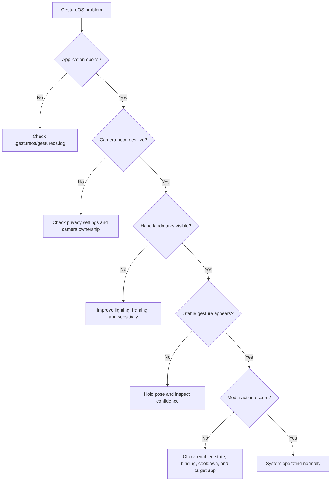

# GestureOS Troubleshooting Guide

## Quick diagnostic flow



## Application does not start

1. For a source run, confirm Python 3.11 and activate `.venv`.
2. Run `pip install -r gestureos\requirements.txt`.
3. Start from a terminal with `python -m gestureos.main` to see console errors.
4. Inspect `%USERPROFILE%\.gestureos\gestureos.log`.
5. If using the installed application, reinstall with the latest setup executable.

The windowed release has no console. The log file is the primary startup diagnostic.

## Camera unavailable

| Check | Resolution |
|---|---|
| Windows privacy permission | Enable camera access for desktop apps in Privacy & security settings. |
| Camera already in use | Close conferencing, browser, recording, and virtual-camera software. |
| Wrong camera index | Update `camera_index` in settings JSON, then restart recognition. |
| Device disconnected | Reconnect it and enable recognition again. |
| Driver failure | Test the device in the Windows Camera app and update its driver. |

GestureOS uses the DirectShow backend and requests 640×480 at 30 FPS.

## Hand is not detected reliably

- Keep the complete hand and wrist inside the preview.
- Use even front lighting; avoid a bright window behind the hand.
- Separate the hand visually from a cluttered background.
- Reduce sensitivity gradually in Settings if detection does not begin.
- Increase sensitivity if false hands are detected.
- Use the confidence meter and raw gesture display to distinguish landmark loss from
  classification mismatch.

## Wrong or unstable gesture

Static gestures use finger-joint straightness and exact finger-state patterns.
Hold the pose for at least 0.5 seconds. For thumb gestures, make the vertical thumb
direction unambiguous. If raw recognition is correct but stable remains Unknown,
keep the pose still while the temporal filter accumulates a majority.

## Gesture appears but no action occurs

1. Open Settings and ensure the gesture is checked.
2. Confirm it is not bound to **No action**.
3. Leave the pose before repeating it; held static poses fire once.
4. Wait for the global gesture cooldown.
5. Confirm the target media application responds to Windows media keys.
6. Check the action log and application log for queued-action errors.

Pinch volume is controlled by pinch movement rather than the static binding table.

## Swipe does not trigger

Move the whole hand horizontally in a deliberate 0.1–0.7 second motion. Horizontal
movement must dominate vertical movement and remain directionally consistent. Slow
drift and diagonal movement are rejected intentionally.

## Pinch volume is noisy or inactive

- Bring thumb and index tips close enough for the overlay to report a pinch.
- Establish the pinch before moving vertically.
- Move smoothly; small jitter is ignored.
- Keep roughly the same distance from the camera during the movement.

## Double clap does not work

| Symptom | Resolution |
|---|---|
| Microphone unavailable status | Enable microphone access for desktop apps. |
| No detection | Clap twice, 200–1000 ms apart, near the selected input device. |
| False triggers | Reduce background impulses and move away from keyboard/desk impacts. |
| Wrong input device | Select the intended Windows default recording device before launch. |

Speech and steady noise are rejected using peak-to-RMS ratio and an adaptive noise floor.

## High latency or low FPS

Open the Diagnostics tab and compare Camera FPS with Recognition FPS.

- Low Camera FPS suggests a camera/driver, USB, or lighting issue.
- Camera FPS above Recognition FPS with increasing dropped frames indicates inference
  saturation. Drops are expected and keep latency bounded.
- High latency without drops suggests driver-side buffering or system contention.
- Disable the overlay in JSON for a diagnostic comparison.
- Close CPU-heavy applications and use a 640×480 camera mode.

See the [Benchmark Report](BENCHMARK_REPORT.md) for expected queue behavior.

## Settings reset or fail to save

Installed settings live at `%APPDATA%\GestureOS\config\settings.json`. Confirm the
directory is writable. Invalid JSON or unsupported values cause a safe fallback to
defaults. Back up the file before manual editing and make changes while GestureOS
is closed to avoid overwriting them from the Settings dialog.

## Startup launch does not work

Toggle **Launch at Windows Startup** off and on. GestureOS reconciles the launcher
at application startup. Check for `GestureOS.cmd` under:

```text
%APPDATA%\Microsoft\Windows\Start Menu\Programs\Startup
```

Security software or organizational policy may prohibit Startup-folder scripts.

## Installer or build problems

- Use `.\build_release.cmd`; it avoids PowerShell execution-policy restrictions.
- Install NSIS with `winget install --id NSIS.NSIS -e`.
- For portable NSIS, set `NSIS_MAKENSIS` to the absolute `makensis.exe` path.
- If OneDrive locks the PyInstaller cache, the release script automatically retries
  without deleting the cache.
- Check `build\GestureOS\warn-GestureOS.txt` for optional-module warnings.

## Collecting information for a bug report

Include:

- GestureOS version and whether it is installed or run from source.
- Windows version, webcam model, and CPU.
- Relevant log excerpt with personal paths removed if desired.
- Diagnostics screenshot showing FPS, latency, CPU, RAM, threads, and gesture.
- Reproduction steps and whether the issue persists with default settings.

Do not attach camera images unless you intentionally want to share them.
