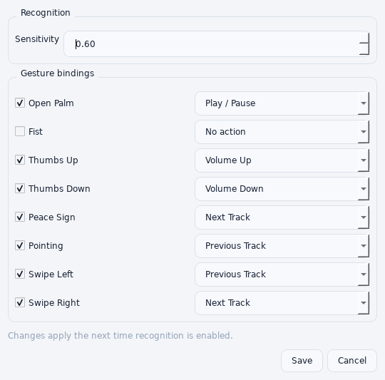
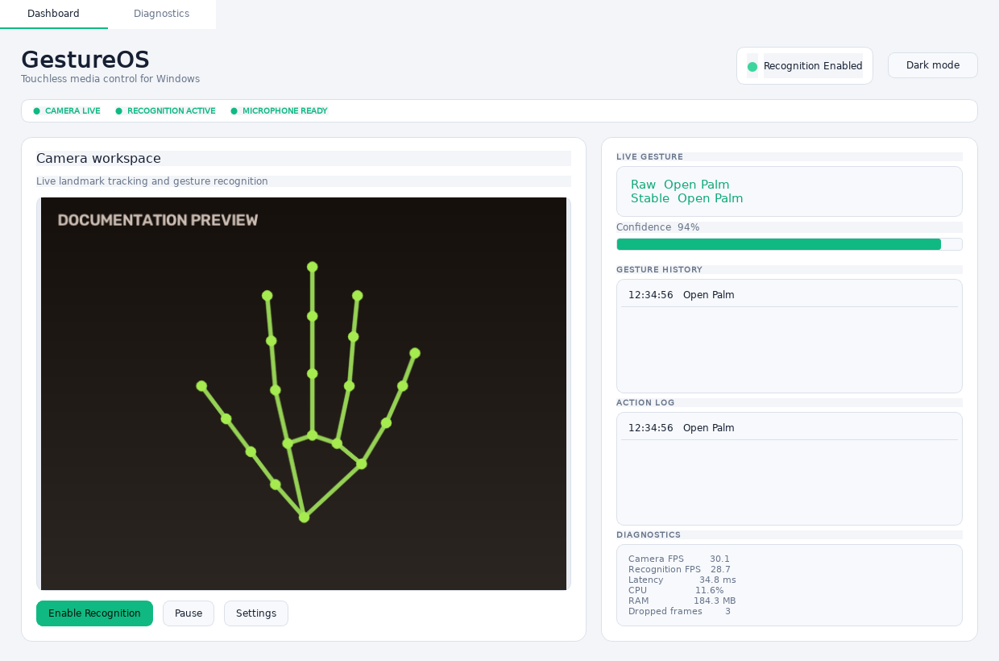
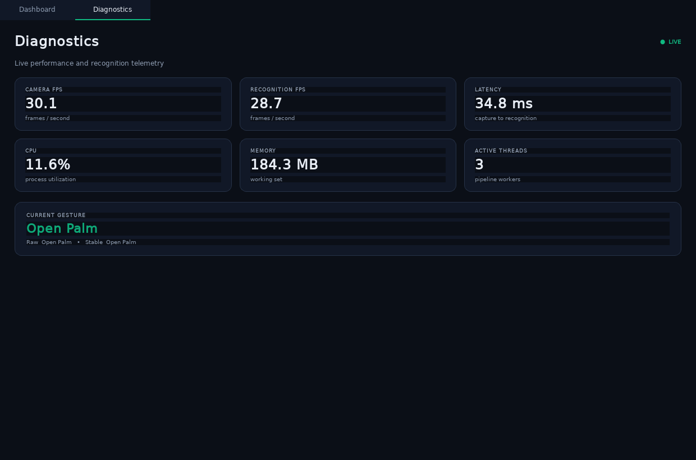

# GestureOS User Guide

## 1. Getting started

Install GestureOS with `GestureOS-1.0.0-rc.1-Setup.exe`, then launch it from the desktop
or Start Menu. On first launch, a short walkthrough explains gestures, tray mode,
and double-clap activation.

Windows may ask for camera and microphone permission. Both permissions are needed
for the complete experience. Gesture recognition can still be started manually if
microphone access is unavailable.

## 2. Dashboard

The dashboard contains:

1. **Status badge** — overall recognition state.
2. **System status strip** — camera, recognition, and microphone readiness.
3. **Camera workspace** — live video, landmarks, and optional diagnostic overlay.
4. **Live gesture** — raw and temporally stabilized recognition results.
5. **Confidence** — confidence of the current static-gesture classification.
6. **Gesture history** — the last 50 stable gesture transitions.
7. **Action log** — the last 50 executed gesture actions.
8. **Diagnostics summary** — FPS, latency, CPU, RAM, and dropped frames.

Select **Enable Recognition** to open the camera. Select **Pause** to release it.
Closing the window hides GestureOS in the system tray; it does not stop active
recognition. Double-click the tray icon to reopen the window.

## 3. Performing gestures

Keep one hand visible, approximately centered, with the full wrist and fingertips
inside the frame. Hold static gestures briefly: the filter requires a stable
majority for approximately 0.5 seconds before an action occurs.

| Gesture | Technique |
|---|---|
| Open Palm | Face an open hand toward the camera with all fingers straight. |
| Thumbs Up/Down | Fold four fingers and orient the thumb clearly up or down. |
| Peace Sign | Extend index and middle fingers; fold the others. |
| Pointing | Extend only the index finger. |
| Swipe | Move the complete hand horizontally in one deliberate motion. |
| Pinch volume | Touch thumb and index tips, then move the pinch upward or downward. |

Actions fire once when a stable pose is entered. Return to a neutral or different
pose before repeating the same static action. Pinch volume emits controlled steps
as the pinched hand moves vertically.

## 4. Customizing controls

Open **Settings** from the dashboard or tray menu.

For each static or swipe gesture:

- Clear its checkbox to prevent it from executing actions.
- Select Play/Pause, Volume Up, Volume Down, Next Track, Previous Track, or No Action.
- Adjust **Sensitivity** between 0.00 and 1.00. Higher values demand more confident
  MediaPipe detection and tracking.

Save the dialog, pause recognition if it is active, and enable it again. Recognition
settings are loaded when a new camera session begins.

Settings are stored in JSON:

- Installed build: `%APPDATA%\GestureOS\config\settings.json`
- Source checkout: `gestureos\config\settings.json`

If the file is invalid, GestureOS safely returns to defaults.

## 5. Dark and light themes

Use **Light mode** or **Dark mode** in the title area. The choice is saved immediately.

The layout adapts to the available width. On compact windows, the camera and
activity panels stack vertically and remain accessible through scrolling.

## 6. Diagnostics

Open the **Diagnostics** tab for the full live telemetry view.

| Metric | Meaning |
|---|---|
| Camera FPS | Webcam frames captured per second. |
| Recognition FPS | Frames completed by the recognition pipeline per second. |
| Latency | Time from frame capture to completed recognition/action dispatch. |
| CPU | GestureOS process utilization normalized across logical CPU cores. |
| Memory | GestureOS working-set RAM. |
| Active threads | Running capture, recognition, and action pipeline threads. |
| Current gesture | Most useful current result, plus raw and stable values. |

Dropped frames are intentional when capture is faster than recognition. Dropping
stale frames keeps the displayed and acted-on hand position current.

## 7. Tray and startup controls

The tray menu provides:

- Open GestureOS
- Settings
- Enable or disable recognition
- Launch at Windows Startup
- Exit

**Exit** stops the camera asynchronously, drains accepted actions, releases the
microphone, removes the tray icon, and closes the application.

## 8. Uninstalling

Use Windows **Settings > Apps > Installed apps > GestureOS**, or choose
**Uninstall GestureOS** from the Start Menu. User settings are retained so a later
installation can restore preferences. Delete `%APPDATA%\GestureOS` manually if you
also want to remove saved settings and logs.
