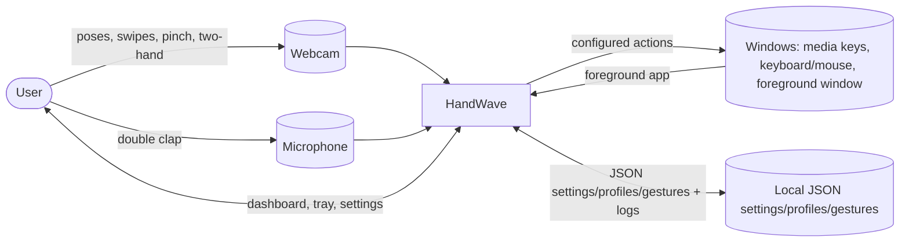
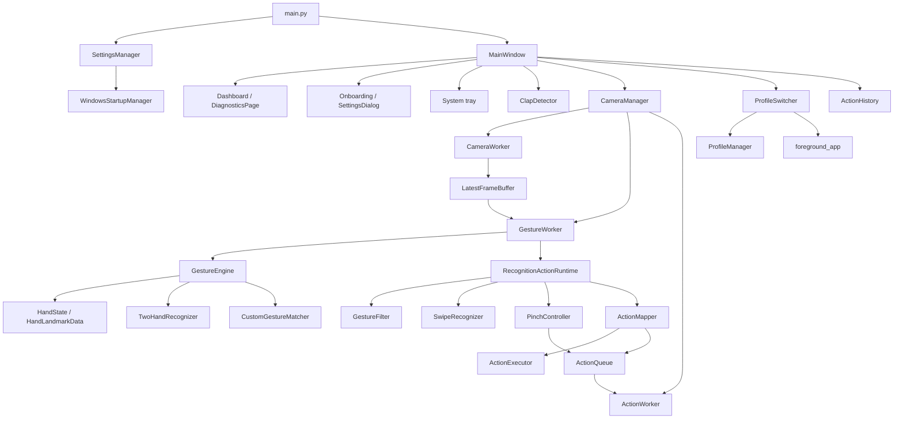

# Architecture

## Design goals

HandWave prioritizes fresh input over processing every frame, keeps blocking
work off the UI thread, confines mutable recognition state to one worker
thread, and isolates OS side effects behind an action queue. It is
Windows-specific at its camera backend, keyboard/mouse/media-key, startup,
foreground-app detection, and packaging boundaries. Everything runs locally —
there is no network service, account system, or database.

## System context

## Component architecture

## Threads and why

| Thread | Owns | Never blocks on |
|---|---|---|
| UI (Qt main) | `MainWindow`, dialogs, tray | camera I/O, MediaPipe, OS action calls |
| Capture | `CameraWorker` — `cv2.VideoCapture` | recognition or action execution |
| Recognition | `GestureWorker` — MediaPipe, `GestureEngine`, filters, `ActionMapper.execute()` | OS action calls (queued instead) |
| Action | `ActionWorker` draining `ActionQueue` | camera or recognition |

`LatestFrameBuffer` (capacity one) sits between capture and recognition: when
recognition can't keep up, the capture thread's *newest* frame replaces the
unprocessed one instead of queuing — see [benchmarking.md](benchmarking.md)
for the measured effect. `ActionMapper.execute()` never calls the OS directly;
it hands a callback to `ActionQueue`, so a slow keyboard/mouse/program-launch
call can never stall recognition (see [actions.md](actions.md)).

## Data flow per frame

1. `CameraWorker` reads a frame, pushes it into `LatestFrameBuffer`.
2. `GestureWorker` pulls the latest frame, runs MediaPipe (up to 2 hands),
   builds one `HandState` per detected hand.
3. `GestureEngine.recognize_hands()` — the single recognition entry point used
   both live and by `tools/replay_gesture.py` — runs built-in pattern
   matching, an optional custom-gesture matcher, and `TwoHandRecognizer`.
4. `RecognitionActionRuntime` filters, evaluates pinch and swipe motion, and
   uses the gesture arbitration policy to choose one action name: **two-hand
   gesture > pinch > swipe > static gesture** (see
   [gesture-recognition.md](gesture-recognition.md)).
5. `ActionMapper.execute()` applies cooldown/re-arm/hold-duration rules and
   either runs the bound `ActionDefinition` (via the queue) or records why it
   didn't (`ActionOutcome.blocked_reason`).
6. `MainWindow` logs the outcome into a bounded `ActionHistory` and updates
   the dashboard/diagnostics.

## Application profiles

`ProfileManager` (`handwave/config/profile_manager.py`) persists named
`Profile` objects that override a *sparse* subset of global settings
(sensitivity, cooldown, gesture bindings) — unset fields inherit the global
value at `Profile.resolve()` time, so profiles never copy the whole
configuration. `ProfileSwitcher` polls the foreground application
(`handwave/services/foreground_app.py`, Win32 `ctypes`) and matches it against
profiles deterministically (disabled profiles excluded; exact executable +
window-title match beats executable-only; no match falls back to explicit
selection, then Global). Applying a switch only swaps `ActionMapper`'s
bindings/cooldown in place — the camera thread and MediaPipe instance are
never recreated. See [profiles.md](profiles.md).

## Persistence

`SettingsManager`, `ProfileManager`, and `CustomGestureStore` all follow the
same pattern: a `schema_version` field, atomic `temp-file + os.replace` writes
(via `handwave/config/atomic_write.py`, which retries past the transient
`PermissionError` a cloud-sync client like OneDrive can cause), a `.bak` copy
written before every overwrite, and recovery from that backup if the primary
file is corrupted JSON.

## Known limitations

- Two-hand tracking assumes MediaPipe's hand identity stays stable across a
  frame; hands crossing rapidly can occasionally swap which `HandState` is
  "primary" — not a crash, just a possible one-frame pose flicker.
- `ProfileSwitcher`'s foreground-app lookup can fail (return unknown) for
  elevated/protected processes; it falls back to Global rather than guessing.
- Custom gestures currently support static poses only (see
  [gesture-recognition.md](gesture-recognition.md) for what's structurally
  ready but not yet implemented: motion and two-hand custom gestures).
