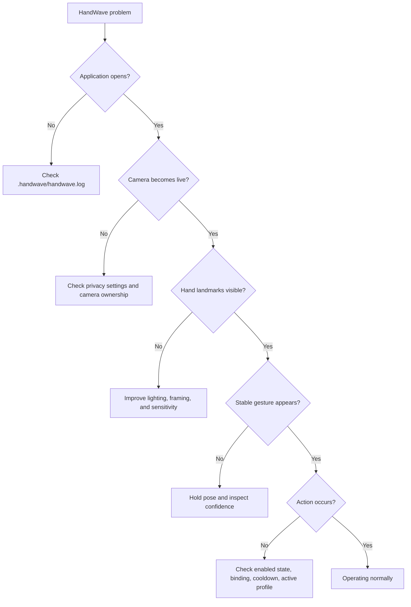

# Troubleshooting

## Quick diagnostic flow



## Application does not start

1. For a source run, confirm Python 3.11 and run `.\setup.cmd`.
2. Start from a terminal with `.\run.cmd` (or `python -m handwave.main`) to see console errors.
3. Inspect `%USERPROFILE%\.handwave\handwave.log`.
4. Set `HANDWAVE_STARTUP_PROFILE=1` before launch to see a checkpoint-by-checkpoint timing log (see [development.md](development.md#startup-performance-discipline)).
5. If using the installed application, reinstall with the latest setup executable.

## Camera unavailable

| Check | Resolution |
|---|---|
| Windows privacy permission | Enable camera access for desktop apps in Privacy & security settings. |
| Camera already in use | Close conferencing, browser, recording, and virtual-camera software. |
| Wrong camera index | Change the camera index in Settings → Camera, then restart recognition. |
| Device disconnected | Reconnect it and enable recognition again. |
| Driver failure | Test the device in the Windows Camera app and update its driver. |

HandWave uses the DirectShow backend and requests 640x480 at 30 FPS.

## Hand is not detected reliably

- Keep the complete hand and wrist inside the preview.
- Use even front lighting; avoid a bright window behind the hand.
- Separate the hand visually from a cluttered background.
- Adjust sensitivity in Settings → General.
- Use the confidence meter and raw gesture display to distinguish landmark loss from classification mismatch.

## Two hands behave unexpectedly

- Diagnostics shows `Hands detected` and each hand's pose; confirm both are
  detected before expecting a two-hand gesture.
- Both hands must hold the *same* pose (Open Palm or Fist) simultaneously —
  mismatched poses are deliberately treated as no gesture, to avoid false
  activation (see [gesture-recognition.md](gesture-recognition.md)).
- If hands cross rapidly, a one-frame pose flicker on which hand is "primary" is a known limitation, not a crash.

## Wrong or unstable gesture

Static gestures use finger-joint straightness and exact finger-state
patterns. Hold the pose for at least 0.5 seconds. For thumb gestures, make
the vertical thumb direction unambiguous. If raw recognition is correct but
stable remains Unknown, keep the pose still while the temporal filter
accumulates a majority.

## Gesture appears but no action occurs

1. Open Settings → Gestures & Actions and ensure the gesture is checked and not bound to "No action."
2. Check the Action Log — blocked actions now show *why* (e.g. "cooldown
   active", "gesture not re-armed", "hold duration not met"); see
   [actions.md](actions.md#why-an-action-was-or-wasnt-executed).
3. Leave the pose before repeating it; held static poses fire once until re-armed.
4. Confirm no application profile is silently overriding the binding (dashboard shows `Active profile`).
5. Confirm the target application responds to the configured action (media keys, keyboard, mouse).

Pinch volume is controlled by pinch movement rather than the static binding table.

## Swipe does not trigger

Move the whole hand horizontally in a deliberate 0.1-0.7 second motion.
Horizontal movement must dominate vertical movement and remain directionally
consistent. Slow drift and diagonal movement are rejected intentionally.

## Pinch volume is noisy or inactive

- Bring thumb and index tips close enough for the overlay to report a pinch.
- Establish the pinch before moving vertically.
- Move smoothly; small jitter is ignored.
- Keep roughly the same distance from the camera during the movement.

## Double clap does not work

| Symptom | Resolution |
|---|---|
| Microphone unavailable | Enable microphone access for desktop apps; call `retry()` after reconnecting a device. |
| No detection | Clap twice, 0.2-1.0s apart, near the selected input device. |
| False triggers | Run calibration in a quiet room (`begin_calibration`/`feed_calibration_sample`/`finish_calibration`) to set an ambient-noise-appropriate threshold. |
| Wrong input device | Select the intended Windows default recording device before launch. |

Speech and steady noise are rejected using peak-to-RMS ratio plus an adaptive
noise floor; see [architecture.md](architecture.md) and
`handwave/services/clap_detector.py`. No audio is ever recorded to disk.

## Application profile does not switch automatically

- Confirm "Automatically switch application profiles" is enabled in Settings → General.
- Confirm the profile's `app_executable` matches the target's actual process
  image name (case-insensitive, basename only — e.g. `spotify.exe`, not a
  full path or window title).
- Elevated/protected foreground processes may not resolve; this falls back
  to Global rather than erroring (see [profiles.md](profiles.md)).

## High latency or low FPS

Open the Diagnostics tab and compare Camera FPS with Recognition FPS.

- Low Camera FPS suggests a camera/driver, USB, or lighting issue.
- Camera FPS above Recognition FPS with increasing dropped frames indicates inference saturation — drops are expected and keep latency bounded.
- High latency without drops suggests driver-side buffering or system contention.
- Close CPU-heavy applications and use a 640x480 camera mode.

See [benchmarking.md](benchmarking.md) for expected queue behavior.

## Settings, profiles, or custom gestures reset or fail to save

Installed data lives under `%APPDATA%\HandWave\config\` (`settings.json`,
`profiles.json`, `custom_gestures.json`). Confirm the directory is writable.
Invalid JSON or unsupported values fall back to the `.bak` backup, then to
defaults, never a crash. Back up files before manual editing and make
changes while HandWave is closed.

## Startup launch does not work

Toggle **Launch at Windows Startup** off and on from the tray menu (this is
the only place it's controlled — see [development.md](development.md) for
why it isn't duplicated in the Settings dialog). Check for `HandWave.cmd`
under:

```text
%APPDATA%\Microsoft\Windows\Start Menu\Programs\Startup
```

Security software or organizational policy may prohibit Startup-folder scripts.

## Installer or build problems

- Use `.\build_release.cmd`; it avoids PowerShell execution-policy restrictions.
- Install NSIS with `winget install --id NSIS.NSIS -e`.
- For portable NSIS, set `NSIS_MAKENSIS` to the absolute `makensis.exe` path.
- If OneDrive locks the PyInstaller cache (or any atomic-write temp file — see [architecture.md](architecture.md#persistence)), the retry logic handles it automatically.
- Check `build\HandWave\warn-HandWave.txt` for optional-module warnings.

## Collecting information for a bug report

Include:

- HandWave version and whether it is installed or run from source.
- Windows version, webcam model, and CPU.
- Relevant log excerpt with personal paths removed if desired.
- Diagnostics screenshot showing FPS, latency, CPU, RAM, threads, hands detected, and gesture.
- Reproduction steps and whether the issue persists with default settings.
